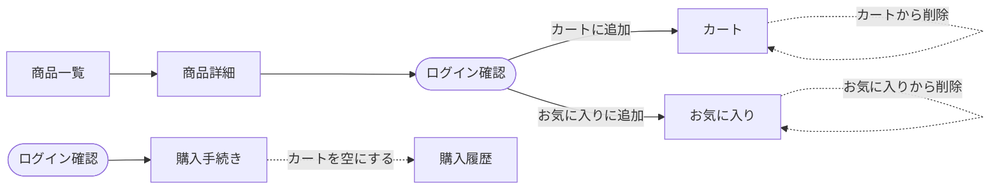
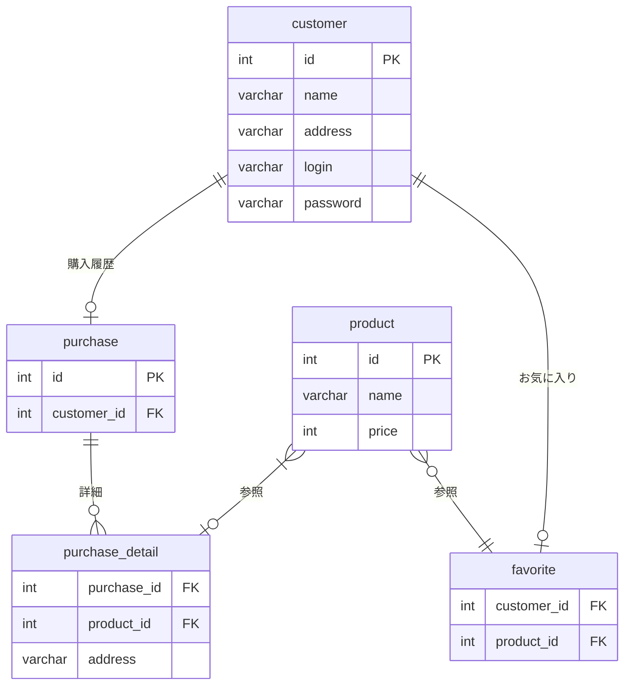

### 画面遷移

```mermaid
flowchart LR
        product[商品一覧]
        detail[商品詳細]
        favorite[お気に入り]
        cart[カート]
        login([ログイン確認])
        login2([ログイン確認])

    product --> detail
    detail --> login
    login --カートに追加--> cart
    cart -.カートから削除.-> cart
    login --お気に入りに追加--> favorite
    favorite -.お気に入りから削除.-> favorite
        purchase[購入手続き]
        history[購入履歴]
        login([ログイン確認])

    login2 --> purchase -.カートを空にする.-> history
```
### データベース構成  

```mermaid
erDiagram
    customer ||--o| purchase : "購入履歴"
    product }|--o| purchase_detail : "参照"
    purchase ||--o{ purchase_detail : "詳細"
    customer ||--o| favorite : "お気に入り"
    product }o--|| favorite : "参照"

    customer {
        int id PK
        varchar name
        varchar address
        varchar login
        varchar password
    }
    product {
        int id PK
        varchar name
        int price
    }
    purchase {
        int id PK
        int customer_id FK
    }
    purchase_detail {
        int purchase_id FK
        int product_id FK
        varchar address
    }
    favorite {
        int customer_id FK
        int product_id FK
    }
```